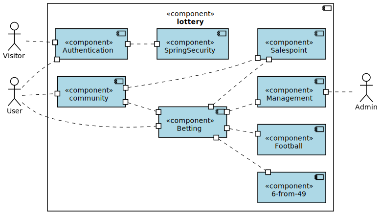
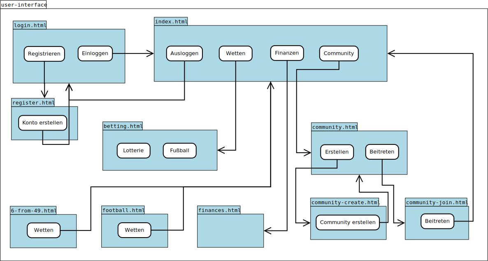
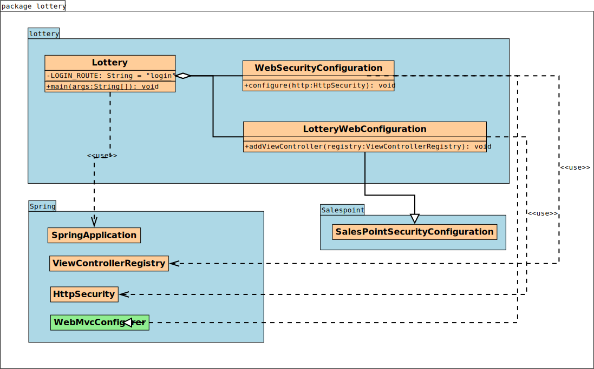
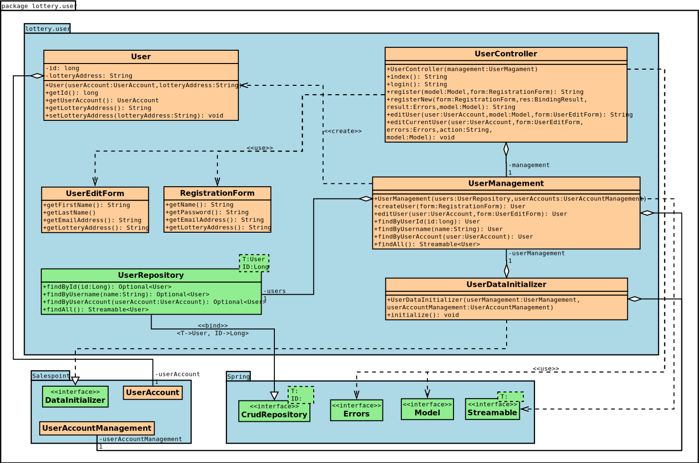
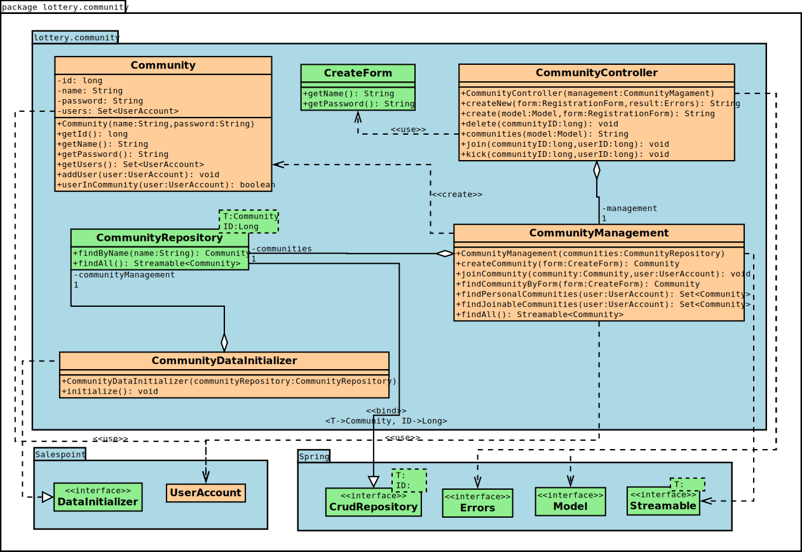
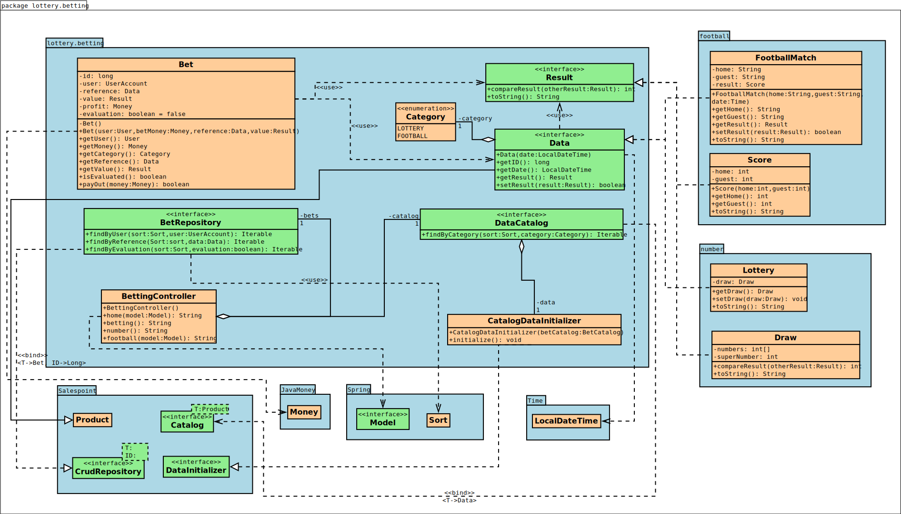
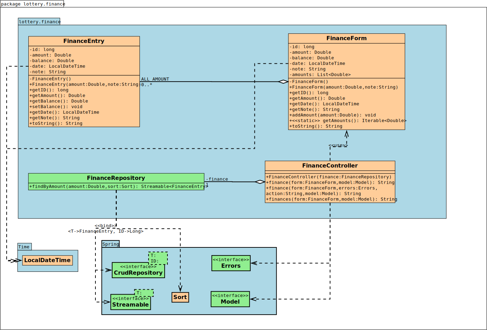
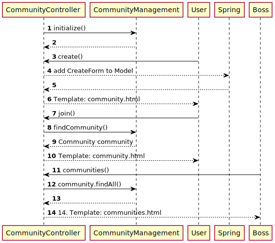
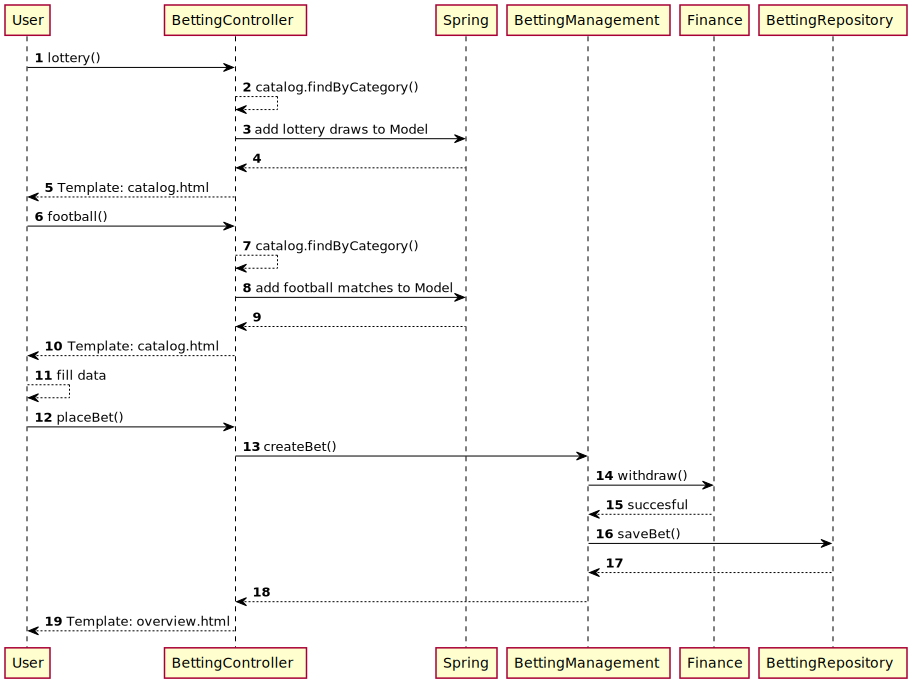

= Entwicklerdokumentation
:toc:
:toc-title: Inhaltsverzeichnis
:numbered:
:project_name: "MACH DEIN GLÜCK" - Onlinelotterie

[options="header"]
[cols="1, 3, 3"]
|===
|Version | Bearbeitungsdatum   | Autor 
|0.1	| 04.11.2021 | Nick
|0.2    | 09.11.2021 | Nick
|0.3    | 10.11.2021 | Hannes, Nick
|0.4    | 13.11.2021 | Nick
|1.0    | 14.11.2021 | Hannes, Nick
|===

== Einführung und Ziele

=== Aufgabenstellung

In unserem kleinen Nachbarland Gamblien ist die staatlich betriebene Lotterie Mach Dein Glück!! sehr populär.
In Staatsbesitz befindet sich auch das weitverbreitete Netz an Annahmestellen.
Gambliens Wirtschaftsminister Lottermann plant den Einstieg in die "virtuelle Lotterie", um auch Ausländer als Kunden zu gewinnen.
Vorbereitend sollen der aktuelle Betrieb der Lotterie und der Annahmestellen auf Computer umgestellt und auf dieser Basis neue Dienste erprobt werden.
Aktuell gibt es bei Mach Dein Glück!! eine Zahlenlotterie mit wöchentlicher Ziehung und ein Fußballtoto.
Die Lotterie Mach Dein Glück!! ist eine ganz konventionelle Lotterie "6 aus 49 mit Zusatzzahl".
Tippscheine werden an den Annahmestellen bis zum Samstag eingereicht; am Sonntag erfolgt unter strenger notarieller Aufsicht die Ziehung.
Das Fußballtoto bezieht sich mangels eigener Liga auf die oberen beiden Klassen der deutschen Bundesliga.
Tippscheine können bis 24 Stunden vor Beginn des Spieltags (evtl. auf mehrere Spieltage verteilt und erst mit dem letzten Nachholspiel beendet) in Bundesliga bzw. Pokalrunden eingereicht werden.
Bei der Zahlenlotterie können derzeit neben Einzeltippscheinen auch Dauertippscheine (monatlich, halb- bzw. ganzjährig) erworben werden.
Tippscheine für das Fußballtoto können ab Veröffentlichung der Spielkalender beliebig im Voraus ausgefüllt und abgegeben werden.
Nach Minister Lottermanns Plänen soll das Angebot künftig gemäß den neuen Medien flexibler gestaltet sein:

* Sobald ein unregistrierter Besucher die virtuelle Lotterie aufruft, erhält dieser die Möglichkeit sich zu registrieren.
* Jeder registrierte Kunde erhält ein Konto, welches ihm ermöglicht, per Überweisung, Tippscheine zu erwerben und Einblick in mögliche Gewinne oder Verluste bietet.
Des Weiteren werden auf dem Konto alle Mitteilungen angezeigt, welche vom System an den Kunden verschickt werden.
* Es werden Gewinngemeinschaften unterstützt. Beim Einrichten einer Gewinngemeinschaft wird von der Lotterie ein Gemeinschafts-Passwort vergeben.
Wer das Gemeinschafts-Passwort kennt, darf für die Gemeinschaft einen Tipp abgeben und darf seinerseits an Personen Mitglieder-Passwörter vergeben.
Mit dem Mitglieder-Passwort kann die Person ihre Anteile (ganzzahlige Vielfache des Grundeinsatzes) bis jeweils vor Wettschluss (gegen Bar- bzw. Vorauszahlung) erhöhen oder verringern bzw. zeitweilig ganz aussetzen.
* Änderungen am Tipp bzw. Einsatz sind bis jeweils 5 Minuten vor Beginn einer Auslosung bzw. eines Fußballspieltags möglich.
Anschließend sperrt das System jegliche Versuche, einen Tippschein abzugeben.
* An die Stelle von Bareinzahlung sollen künftig Abbuchungen von Konten bei der Lotteriebank treten, die jeder Kunde dort einrichtet und auf die er bar oder per Überweisung rechtzeitig seine Einsätze überträgt.
Von diesem Konto werden (in der Reihenfolge der Auslosungen) Einsätze abgebucht.
Bei nicht ausreichender Deckung erhält der Kunde eine entsprechende Mitteilung und nimmt an dieser Verlosung nicht teil.
Je Mitteilung wird eine Gebühr von 2 € erhoben; nach zehn Mitteilungen wird der Kunde vorläufig aus seinen Gewinngemeinschaften entfernt.
Hat der Kunde eine Ziehung oder ein Fußballtoto gewonnen, kann er sich das gewonnene Geld auf sein Lotterie-Konto auszahlen lassen.
* Die für das Fußballtoto benötigten Daten werden vom System direkt und aktuell aus dem Internet bezogen.
* Administratoren der Lotterie sollen die Möglichkeit haben, jederzeit eine Übersicht über die abgegebenen Wetten der Kunden und die finanzielle Situation (Gewinne/Verluste) der Lotterie nach dem jeweiligen Ziehungstagen und Spieltagen zu bekommen.
* Minister Lottermann hat unter dem Aktenzeichen "MDG 2000" eine Ausschreibung veröffentlicht, und um Einreichung geeigneter, künftig ausbaubarer Prototypen für ein solches System gebeten.

Das Ziel des hier beschriebenen Projektes ist die Erstellung einer einfach zu bedienenden und für jedermann zugänglichen virtuellen Lotterie, welche die oben beschriebenen Aufgaben verlässlich und möglichst effizient erfüllen kann.
Der Prototyp soll des Weiteren künftig ausbaubar und gut wartbar sein.

=== Qualitätsziele

Sicherheit::
Beschreibung folgt ...

Nutzerfreundlichkeit::
Beschreibung folgt ...

Erreichbarkeit::
Beschreibung folgt ...

Wartbarkeit::
Beschreibung folgt ...

Ausbaubarkeit::
Beschreibung folgt ...

[options="header"]
[cols="3,1,1,1,1,1"]
|===
|Qualitätsziel |1 |2 |3 |4 |5
|Sicherheit | | |x | |
|Nutzerfreundlichkeit | | | | |x
|Erreichbarkeit | | | |x |
|Wartbarkeit | | |x | |
|Ausbaubarkeit | | | |x |
|===

== Randbedingungen

=== Hardware-Vorgaben

Benötigte Hardware, um die Anwendung effektiv zu betreiben:

- Server
- Computer
- Tastatur
- Maus

=== Software-Vorgaben

Java Version, die für das betreiben der Anwendung benötigt wird:

- Java 11

Browser, die die Anwendung voll unterstützen:

- Mozilla Firefox
- Google Chrome
- Apple Safari

=== Vorgaben zum Betrieb des Software

Die Anwendung soll als Online-Variante der Lotterie "Mach Dein
Glück!!" verwendet werden und wird vom Wirtschaftsministerium Gambliens betrieben. Die Plattform sollte auf einem Server betrieben werden, welcher das Glücksspiel zu jeder Zeit ermöglicht.

Der Hauptnutzer der Anwendung sollen jegliche Menschen aus dem In- und Ausland sein. Dabei soll das Erlebnis für angemeldete User priorisiert werden. Die Nutzung soll durch eine eindeutige Benutzeroberfläche für jeden zugänglich sein. Wetten sind schnell abschließbar, um den Nutzer intuitive Entscheidungen zu vereinfachen. Der Administrator hat Einsicht über alle Aktivitäten auf der Plattform, ohne groß Einfluss nehmen zu müssen.

== Kontextabgrenzung

=== Kontextdiagramm
image::./diagrams/developer_docu/context-diagram.svg[context diagram, title= "Kontextdiagramm", align=center]

== Lösungsstrategie

=== Erfüllung der Qualitätsziele

[options="header"]
[cols="1, 2"]
|=== 
|Qualitätsziel |Lösungsansatz
|Qualitätsziel |
|Sicherheit |
|Nutzerfreundlichkeit |
|Erreichbarkeit |
|Wartbarkeit |
|Ausbaubarkeit |
|===

=== Softwarearchitektur

=== Entwurfsentscheidungen
==== Verwendete Muster

- Spring MVC

==== Persistenz

Die Anwendung verwendet Hibernate Annotation um die Java-Klassen in einer Datenbank zu hinterlegen. Als Datenbank wird H2 benutzt. Im Normalzustand ist die Funktion aktiviert. In der Datei _application.properties_ kann die automatische Speicherung deaktiviert werden.

==== Benutzeroberfläche

=== Verwendung externer Frameworks

[options="header", cols="1,2"]
|===
|Externes Package |Verwendet von (Klasse der eigenen Anwendung)
|salespointframework.catalog |betting.Betting
|salespointframework.core a|
- user.UserDataInitializer
- betting.BetDataInitializer
|salespointframework.payment |finance.Finance
|salespointframework.SalespointSecurityConfiguration |lottery.WebSecurityConfiguration
|salespointframework.userAccount |user.User
|springframework.boot |lottery.Application
|springframework.data a|
- betting.BetRepository
- community.CommunityRepository
- finance.FinanceRepository
- football.FootballBetCatalog
- numberLottery.NumberLotteryRepository
- user.UserRepository
|springframework.security |lottery.WebSecurityConfiguration
|springframework.ui a|
- betting.BetController
- community.CommunityController
- finance.FinanceController
- user.UserController
|springframework.validation a|
- community.CommunityController
- user.UserController
|springframework.web |lottery.LotterywebConfiguration
|===

== Bausteinsicht
=== Lottery

[options="header", cols="1,2"]
|===
|Klasse/Enumeration |Description
|Lottery|zentrale Anwendungsklasse um die Anwendung zu starten
|LotteryWebConfiguration |Konfigurationsklasse um _/login_ zu login.html zu binden
|WebSecurityConfiguration |Konfigurationsklasse um grundlegende Sicherheit einzustellen
|===

=== User

[options="header", cols="1,2"]
|=== 
|Klasse/Enumeration |Description
|...|...
|===

=== Community

[options="header", cols="1,2"]
|===
|Klasse/Enumeration |Description
|...|...
|===

=== Betting

[options="header", cols="1,2"]
|===
|Klasse/Enumeration |Description
|BettingController |SpringMVC Controller welcher mögliche Wetten anzeigt
|BettingDataInitializer |Eine Implementierung des DataInitializer um Standard-Daten zu generieren
|BettingCatalog |Eine Erweiterung von Catalog, um bestimmte Datensätze zu erhalten
|Bet |eine gesetzte Wette welche durch Formulare erstellt wird
|Category |Enumeration um Wetten einfach zu unterscheiden
|Data |Überklasse für alle abschließbaren Wetten
|Result |Interface für alle Ergebnisarten
|Lottery |eine Lotterieziehung, auf das eine Wette abgeschlossen wird
|FootballMatch |ein Fußballspiel, auf das eine Wette abgeschlossen wird
|Draw |ein Lotterieziehungsergebnis
|Score |ein Fußballergebnis
|===

=== Finance

[options="header", cols="1,2"]
|===
|Klasse/Enumeration |Description
|FinanceController|SpringMVC Controller welcher Finanztransaktionen anzeigt
|FinanceEntry|ein Finanzeintrag, der gespeichert werden soll
|FinanceForm|eine Klasse um die Eingaben einer Finanztransaktion zu verarbeiten
|FinanceRepository|ein Finanzrepository um Finanzeinträge zu speichern
|===

=== Rückverfolgbarkeit zwischen Analyse- und Entwurfsmodell

[options="header", cols="1,2,2"]
|===
|Klasse/Enumeration (Analysemodell) |Klasse/Enumeration (Entwurfsmodell) |Art der Verwendung
|User a|
- Salespoint.UserAccount
- user.User a|
- Klassenattribut
- Methodenparameter
|Community a|
- Salespoint.UserAccount
- community.Community a|
- Klassenattribut
- Methodenparameter
|CommunityManagement a|
- CommunityController
- CommunityManagement |
|Message|management.Message |
|Bet|betting.Bet|
|Lottery |betting.BettingController |
|FootballPools |betting.BettingController |
|LotteryBet a|
- lottery.Lottery
- Salespoint.Product |Vererbung/Implementierung
|FootballPoolsBet a|
- football.Match
- Salespoint.Product |Vererbung/Implementierung
|BetCatalog a|
- betting.Catalog
- Salespoint.Catalog
- betting.BettingDataInitializer a|
- Vererbung/Implementierung
- Klassenattribut
|System a|
- betting.BetController
- community.CommunityController
- finance.FinanceController
- user.UserController
- betting.BetRepository
- community.CommunityRepository
- finance.FinanceRepository
- football.FootballBetCatalog
- numberLottery.NumberLotteryRepository
- user.UserRepository|
|Finances a|
- finance.FinanceController
- finance.FinanceEntry
- finance.FinanceRepository
|
|BetManagement|management.ManagementController|
|===

== Laufzeitsicht
=== User

=== Community

=== Betting

== Technische Schulden
=== Quality Gate
[options="header"]
|===
|Quality Gate |aktueller Wert |Ziel
|...|...|...
|===

=== Probleme
[options="header", cols="1,4,3,2"]
|===
|Priorität |Beschreibung |Stelle |entsprechendes Quality Gate
|... |...|... |...
|===

