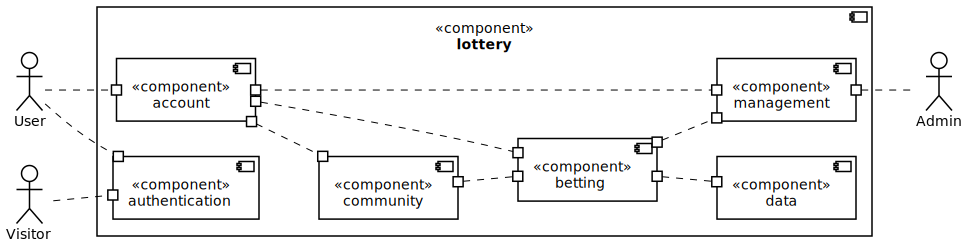
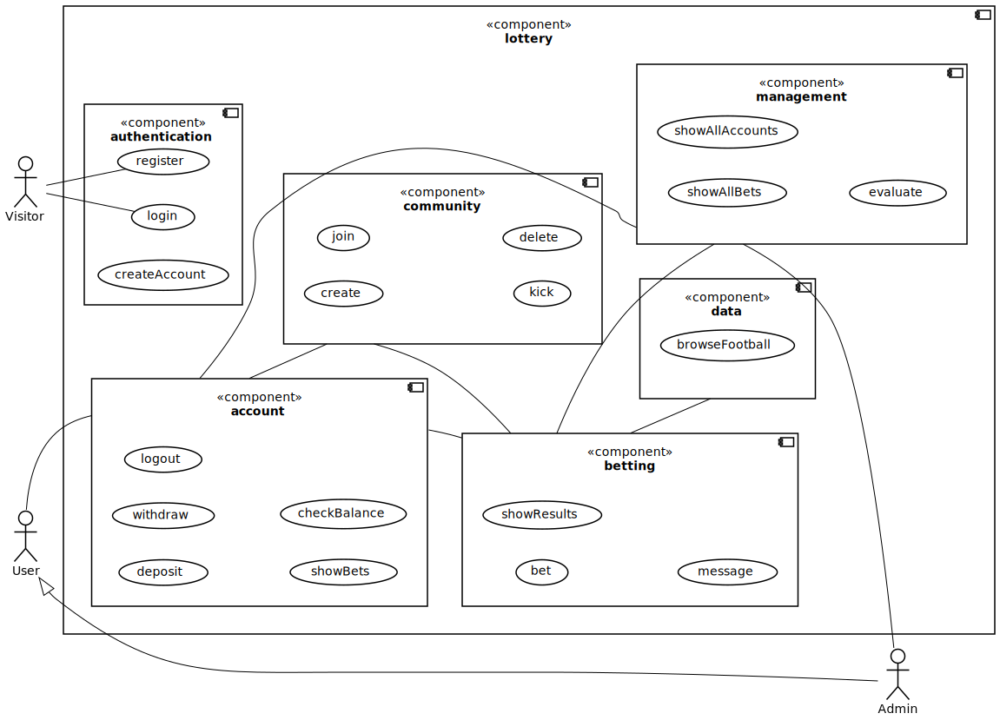
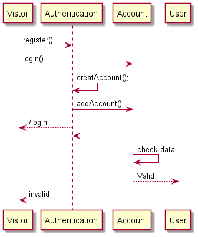
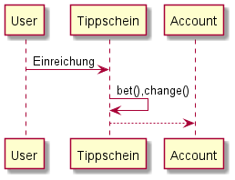
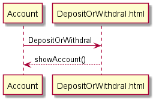
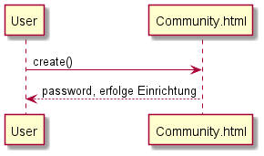
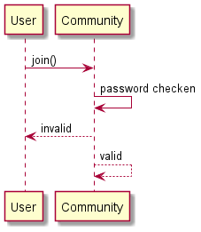
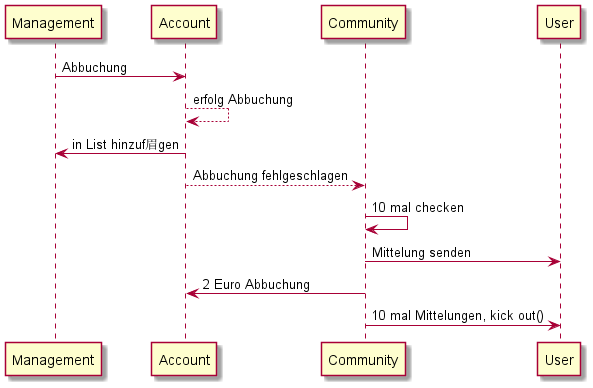
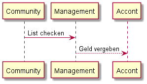

= Pflichtenheft
:project_name: Lotterie
== __{project_name}__

[options="header"]
[cols="1, 1, 1, 1, 4"]
|===
|Version | Status      | Bearbeitungsdatum   | Autoren(en) |  Vermerk
|0.1     | In Arbeit   | 10.10.2021          | Hannes, Nick       | Initiale Version
|===

== Inhaltsverzeichnis
Dieses Dokument benötigt ein Inhaltsverzeichnis. Es existieren mehrere Einbindungsmöglichkeiten.

== Zusammenfassung
Eine kurze Beschreibung des Dokuments. Wenige Absätze.

== Aufgabenstellung und Zielsetzung
Text aus Aufgabenstellung kopieren und ggfs. präzisieren.
Insbesondere ergänzen, welche Ziele mit dem Abschluss des Projektes erreicht werden sollen.

== Produktnutzung
Die Anwendung soll als Online-Variante der Lotterie "Mach Dein
Glück!!" verwendet werden und wird vom Wirtschaftsministerium Gambliens betrieben. Die Plattform sollte auf einem Server betrieben werden, welcher das Glücksspiel zu jeder Zeit ermöglicht.

Das System soll für folgende Browser optimiert werden:

- Mozilla Firefox
- Google Chrome
- Apple Safari

Der Hauptnutzer der Anwendung sollen jegliche Menschen aus dem In- und Ausland sein. Dabei soll das Erlebnis für angemeldete User priorisiert werden. Die Nutzung soll durch eine eindeutige Benutzeroberfläche für jeden zugänglich sein. Wetten sind schnell abschließbar, um den Nutzer intuitive Entscheidungen zu vereinfachen. Der Administrator hat Einsicht über alle Aktivitäten auf der Plattform, ohne groß Einfluss nehmen zu müssen.

== Interessensgruppen (Stakeholders)
[options="header", cols="2, ^1, 3, 4"]
|===
|Name
|Priorität (1..5)
|Beschreibung
|Ziele

|Wirtschaftsministerium Gamblien
|4
|Auftraggeber des Projektes.
a|
- Popularität der Lotterie ins Ausland verbreiten
- Glücksspiel online etablieren
- wirtschaftlichen erfolg erzielen
- automatisiertes Auswerten von Tippscheinen

|Nutzer
|5
|primärer Nutzer vom Online-Service
a|
- übersichtliche Darstellung der Funktionen
- schnelles Wetten
- zuverlässige Gewinnauszahlung

|Besucher
|1
|kein Nutzer der Webseite
a|
- wenig Input über Service preisgeben

-> Besucher zum Registrieren verleiten, um mehr zu erfahren

|Admin
|2
|Administrator der Webseite
a|
- Möglichkeit, alle Wetten einzusehen
- Überwachung der Finanzen der Lotterie

|Programmierer
|3
|Menschen, die später auf dem Grundgerüst des Services aufbauen können für weitere Erweiterungen.
a|
- leicht erweiterbare Webseite
- testbasierte Anwendung für bessere Kontrollen
|===

== Systemgrenze und Top-Level-Architektur

=== Kontextdiagramm

=== Top-Level-Architektur

== Anwendungsfälle

=== Akteure

[options="header"]
[cols="1,4"]
|===
|Name |Beschreibung
|Visitor  |repräsentiert jeden Menschen, der die Webseite ohne angemeldeten Nutzeraccount besucht
|User |repräsentiert jeden Menschen, der einen eingeloggten Account besitzt und die Webseite zum Wetten verwenden möchte
|Admin |repräsentiert jeden User, der Admin-Rechte besitzt; kann auf jegliche Wetten zugreifen und die Finanzsituation überwachen
|===

=== Überblick Anwendungsfalldiagramm

=== Anwendungsfallbeschreibungen
[cols="1h, 3"]
[[UC0010]]
|===
|ID                         |**<<>>**
|Name                       |register
|Beschreibung               |Vistor können einen Account erstellen
|Akteur                     |Vistor
|Trigger                    |Vistor klickt auf "Registrieren"
|Voraussetzungen           a|Vistor ist nicht angemeldet
|Essenzielle Schritte      a|
1. Vistor klickt auf den "Registrieren"
2. Vistor wird auf "register.html" weitergeleitet
3. Vistor gibt Daten ein und klickt auf "Registrieren"
4. System ein neues Konto erstellen
|Erweiterungen              |-
|Funktionale Voraussetzungen|[F0001][F0002]
|===

[cols="1h, 3"]
[[UC0010]]
|===
|ID                         |**<<>>**
|Name                       |login/logout
|Beschreibung               |Vistor soll mit eigenem Konto einloggen können, Dieser Vorgang kann durch Abmelden rückgängig gemacht werden.
|Akteur                     |
Login: Vistor

Logout: User
|Trigger                    |
_Login_:
Vistor klickt auf den Knopf “einloggen”.
_Logout_:
Vistor klickt auf den Knopf “ausloggen”.

|Voraussetzungen           a|
_Login_:
Akteur ist nicht angemeldet.

_Logout_:
Akteur ist angemeldet.
|Essenzielle Schritte      a|
_Login_:

1. Vistor klickt auf den "einloggen".
2. Vistor wird auf "login.html" weitergeleitet.
3. Vistor gibt Daten ein und klickt auf "einloggen".
4. System prüft die Korrektheit der eingegebenen Daten.
1.Richtige Daten: Vistor werden User und bekommen zusätzlichen Rechte.
2.Fehler: Anzeige der Fehlermitteilung.

_Logout_:

1. User klickt auf den "ausloggen".
2. Benutzer kehren zur Startseite zurück und werden Vistor.

|Erweiterungen              |-
|Funktionale Voraussetzungen|[F0003]
|===

[cols="1h, 3"]
[[UC0010]]
|===
|ID                         |**<<>>**
|Name                       |showBets
|Beschreibung               |
Jeder Besucher (d.h. User und Vistor) sollte auf den Katalog zugreifen können,
in dem alle angebotenen Lotterien aufgeführt sind.
Der Katalog muss eine Unterscheidung zwischen den verschiedenen Arten von Lotterien (Zahlenlotterien und Fußballlotterien) enthalten
|Akteur                     |User/Vistor
|Auslöser                   |Akteur klickt auf den Knopf "Zahlenlotterien" oder "Fußballlotterien".
|Voraussetzungen           a|
|Essenzielle Schritte      a|
1. Der Akteur klickt auf den Knopf "Zahlenlotterien" oder "Fußballlotterien".
2. Alle gewählten Lotteriensart werden angezeigt.
|Erweiterungen              |-
|Funktionale Voraussetzungen|[F006]
|===

[cols="1h, 3"]
[[UC0010]]
|===
|ID                           |**<<>>**
|Name                         |bet/bet change
|Beschreibung                 |User können Wetten platzieren und die Anzahl der Wetten ändern.
|Akteur                       |User
|Auslöser                     |User klickt auf den Knopf “bet”.
|Voraussetzungen             a|ist als User eingeloggt
|Essenzielle Schritte        a|
1. User klickt auf den Knopf “bet/bet change”.
2. User gibt die Anzahl der Wetten ein.
|Erweiterungen                |-
|Funktionale Voraussetzungen  |[F0006][F0007][F0008][F0009][F0010]
|===

[cols="1h, 3"]
[[UC0010]]
|===
|ID                         |**<<>>**
|Name                       |checkBalance
|Beschreibung               |Jeder User kann seinen Kontostand einsehen.
|Akteur                     |User
|Auslöser                    |Akteur klickt auf den Knopf "Kontostand" .
|Voraussetzungen           a|Akteur ist eingeloggt.
|Essenzielle Schritte            a|
1. Der Akteur klickt auf den Knopf "Zahlenlotterien" oder "Fußballlotterien".
2. Der Kontostand wird angezeigt.
|Erweiterungen              |-
|Funktionale Voraussetzungen|[F0012]
|===

[cols="1h, 3"]
[[UC0010]]
|===
|ID                         |**<<>>**
|Name                       |withdraw/deposit
|Beschreibung               |User können ihr Guthaben abheben oder ihr Konto aufladen.
|Akteur                     |User
|Auslöser                   |
_withdraw_: Akteur klickt auf den Knopf "withdraw".

_deposit_: Akteur klickt auf den Knopf "deposit".
|Voraussetzungen           a|Akteur ist eingeloggt.
|Essenzielle Schritte      a|
1. Akteur klickt auf den Knopf "withdraw" oder "deposit".
2. Akteur wird auf "withdraw.html"/"deposit.html" weitergeleitet.
3. Akteur wählt den Betrag, den sie aufladen oder abheben möchten
|Erweiterungen              |-
|Funktionale Voraussetzungen|[F0013][F0014]
|===

[cols="1h, 3"]
[[UC0010]]
|===
|ID                           |**<<>>**
|Name                         |show Results
|Beschreibung                 |User können die Wettergebnisse prüfen
|Akteur                       |User
|Auslöser                     |User klickt auf  den Knopf “show Results”.
|Voraussetzungen             a|Der Benutzer hat erfolgreich gewettet und die Wette wurde bewertet.
|Essenzielle Schritte        a|User klickt auf den Knopf “show Results”.
|Erweiterungen                |-
|Funktionale Voraussetzungen  |[F0023][F0024]
|===

[cols="1h, 3"]
[[UC0010]]
|===
|ID                         |**<<>>**
|Name                       |create
|Beschreibung               |User kann eine Gemeinschaft erstellen, das Passwort der Gemeinschaft erhalten und das Passwort verwenden, um andere in die Gemeinschaft einzuladen.
|Akteur                     |User
|Auslöser                   |User möchte eine Gemeinschaft erstellen.
|Voraussetzungen           a|User hat sich beim System authentifiziert.
|Essenzielle Schritte      a|User klickt auf der Webseite auf den Knopf "Eine Gemeinschaft erstellen".
|Erweiterungen              |User kann andere Mitglieder in der Gemeinschaft einladen.
|Funktionale Voraussetzungen|[F0015]
|===

[cols="1h, 3"]
[[UC0010]]
|===
|ID                         |**<<>>**
|Name                       |join
|Beschreibung               |User kann in einer Gemeinschaft beitreten.
|Akteur                     |User
|Auslöser                  a|User möchte in einer Gemeinschaft beitreten.
|Voraussetzungen           a|
1. User hat sich beim System authentifiziert.
2. User hat ein Passwort einer Gemeinschaft.
|Essenzielle Schritte      a|
1.User drückt auf der Website auf den Knopf "Gemeinschaft beitreten".
2.User gebt das Passwort ein.
|Erweiterungen              |-
|Functional Requirements    |[F0016]
|===

[cols="1h, 3"]
[[UC0010]]
|===
|ID                         |**<<>>**
|Name                       |delete
|Beschreibung               |User kann aus einer Gemeinschaft austreten.
|Akteur                     |User
|Auslöser                   |User möchte aus einer Gemeinschaft austreten.
|Voraussetzungen           a|
1. User hat sich beim System authentifiziert.
2. User ist ein Mitglied der Gemeinschaft.
|Essenzielle Schritte      a|User drückt auf der Website die Schaltfläche "Gemeinschaft löschen".
|Erweiterungen              |-
|Funktionale Voraussetzungen|brauch noch
|===

[cols="1h, 3"]
[[UC0010]]
|===
|ID                         |**<<>>**
|Name                       |kick
|Beschreibung               |Nach zehn erfolglosen Abbuchungsbenachrichtigungen wird der Nutzer vorübergehend aus der Community entfernt.
|Akteur                     |Gemeinschaft
|Auslöser                   |Ein Nutzer in einer Gemeinschaft hat eine erfolglose Abbuchungsbenachrichtigungen erhalten.
|Essenzielle Schritte      a|
1. Akteur ist in der Gemeinschaft.
2. Akteur hat schon neu mal erfolglose Abbuchungsbenachrichtigungen erhalten.
|Essential Steps           a|--
|Erweiterungen              |--
|Funktionale Voraussetzungen|[F0018]
|===

[cols="1h, 3"]
[[UC0010]]
|===
|ID                           |**<<>>**
|Name                         |message
|Beschreibung                 |User können empfangene Nachrichten anzeigen.
|Akteur                       |User
|Auslöser                     |User klickt auf  den Knopf “message”.
|Voraussetzungen             a|ist als User eingeloggt
|Essenzielle Schritte        a|User klickt auf  den Knopf “message”.
|Erweiterungen                |-
|Funktionale Voraussetzungen  |[F0019][F0020]
|===

[cols="1h, 3"]
[[UC0010]]
|===
|ID                         |**<<>>**
|Name                       |show all bets
|Beschreibung               |Der Administrator überprüft den Wettstatus jedes Benutzers
|Akteur                     |Admin
|Auslöser                   |Klicken Administratoren auf "Wettstatus"
|Voraussetzungen           a|Benutzer hat Lotto gekauft
|Essenzielle Schritte      a|
1. Der Administrator klickt auf ""Lottoergebnisse anzeigen".
2. Besuchen Sie jedes Benutzerkonto, um den Wettstatus zu erfahren.
3. Die Seite zeigt den Wettstatus aller teilnehmenden Benutzer in der Community.
|Erweiterungen              |-
|Funktionale Voraussetzungen|[F0022]
|===

[cols="1h, 3"]
[[UC0010]]
|===
|ID                         |**<<>>**
|Name                       |show all accounts
|Beschreibung               |Der Administrator überprüft die Gewinne und Verluste des Benutzers nach dem Ziehungstag und nach dem Spieltag
|Akteur                     |Admin
|Auslöser                   |Klicken Administratoren auf "finanzielle Situation"
|Voraussetzungen           a|
1.Benutzer hat Lotto gekauft
2.Die Lotterie wurde gezogen oder das Ergebnis des Spiels wurde veröffentlicht
|Essenzielle Schritte      a|
1. Der Manager klickt auf "finanzielle Situation"
2. Rufen Sie die Wettinformationen aller Benutzer ab
3. Lesen Sie das Lotterieergebnis oder das Ergebnis des Spiels
4. Beurteilen Sie den Gewinn oder Verlust jedes Benutzers
|Erweiterungen              |-
|Funktionale Voraussetzungen|-
|===

[cols="1h, 3"]
[[UC0010]]
|===
|ID                         |**<<>>**
|Name                       |Evaluation of lottery（Two lotteries）
|Beschreibung               |Bestimmen Administratoren, ob das Guthaben auf dem Konto des Benutzers ausreicht, um die Lotterie zu bezahlen
|Akteur                     |Admin
|Auslöser                   |Klicken Administratoren auf "Ergebnisse zeichnen"
|Voraussetzungen           a|
1. Lotto wurde gezogen
2. Benutzer kauft Lotto
|Essenzielle Schritte      a|
1. Der Administrator sendet einen Abzugsantrag an die Konten aller Benutzer, die die Lotterie gekauft haben
2. Das Konto beurteilt, ob das Guthaben ausreicht, um die Lottokaufkosten zu bezahlen
3. Wenn nicht genug, reichen Sie das Lotto des Benutzers ein, um es zu stornieren
4. Falls ausreichend, Konto abziehen und Benutzer zur Liste hinzufügen
|Erweiterungen              |-
|Funktionale Voraussetzungen|
|===

[cols="1h, 3"]
[[UC0010]]
|===
|ID                         |**<<>>**
|Name                       |Liste der Gewinner
|Beschreibung               |Alle Gewinner-Benutzer werden dieser Liste hinzugefügt
|Akteur                     |Admin
|Auslöser                   |Klicken Administratoren auf "Ergebnisse zeichnen"
|Voraussetzungen           a|
1. Lotterieergebnisse bekannt gegeben
2. Benutzerkonto wurde erfolgreich belastet
|Essenzielle Schritte      a|
1. Lesen Sie die finanzielle Situation des Benutzerkontos (gewinnen oder verlieren)
2. Fügen Sie Benutzer hinzu, deren Ergebnisse als ""Win"" angezeigt werden, zur Liste
|Erweiterungen              |-
|Funktionale Voraussetzungen|-
|===

[cols="1h, 3"]
[[UC0010]]
|===
|ID                         |**<<>>**
|Name                       |Geld vergeben
|Beschreibung               |Der Manager sendet Geld an das Konto des Gewinners
|Akteur                     |Admin
|Auslöser                   |Klicken Administratoren auf "Ergebnis Abrechnung"
|Voraussetzungen           a|
1. Lotterieergebnisse bekannt gegeben
2. Der Nutzer ist der Gewinner
|Essenzielle Schritte      a|
1. Der Manager klickt auf "Geld vergeben"
2. Berechnen Sie den Betrag, den jeder Benutzer erhält
3. Geld auf das Benutzerkonto vergeben
|Erweiterungen              |-
|Funktionale Voraussetzungen|[F0023]
|===

== Funktionale Anforderungen

=== Muss-Kriterien
Dieser Abschnitt bietet einen Überblick aller Anforderungen, welche das System leisten muss.

Die folgende Tabelle enthält:

- Eine eindeutige ID für die Anforderung
- Ein Name der Anforderung
- Eine Beschreibung der Anforderung

[cols="1,2,5"]
|===
|ID |Name |Beschreibung

|[F0001]
|Registrierung
a|Das System stellt nicht registrierten Nutzenden die Möglichkeit zur Verfügung, einen Account zu erstellen.
Für eine Registrierung werden folgende Informationen benötigt:

- Nutzername (Einzigartig)
- Passwort
- Wohnadresse
- Lotteriebank-Adresse
- E-Mail-Adresse (Optional)

Das System prüft die angegeben Daten auf ihre Richtigkeit([F0002]). Nach erfolgreicher Überprüfung wird der Nutzende im System eingetragen([F0003]) und ist in der Lage sich Anzumelden.

|[F0002]
|Registrierung validieren
a|Das System ist in der Lage, die Informationen eines nicht registrierten Nutzenden auf ihre Richtigkeit zu überprüfen.
Folgende Daten werden überprüft:

- Einzigartigkeit des Nutzernamens
- Stimmigkeit der Wohnadresse
- Stimmigkeit der Lotteriebank-Adresse
- Stimmigkeit der E-Mail-Adresse (falls vorhanden)

Bei Unstimmigkeiten wird der Nutzende umgehend informiert und kann die Daten gegebenenfalls Anpassen.

|[F0003]
|Anmeldung
a|Das System ist aufgeteilt in Bereiche, die jedem Nutzenden frei zur Verfügung stehen und Bereiche, welche nur durch Login benutzt werden können. Nutzer können durch folgende Informationen Identifiziert:

- Nutzername
- Passwort

|[F0004]
|Konto einsehen
a|Das System ermöglicht den Nutzenden in ihr Konto einzusehen. Es können folgende Informationen eingesehen werden:

- Nutzername
- Wohnadresse
- E-Mail-Adresse (falls vorhanden)

|[F0005]
|Konto bearbeiten
a|Das System ermöglicht dem Nutzenden, bei Bedarf, Informationen zu bearbeiten oder hinzuzufügen. Folgende Informationen können bearbeitet werden:

- Passwort
- Wohnadresse
- Lotteriebank-Adresse
- E-Mail-Adresse

Das System überprüft bei Änderung die neuen Daten auf ihre Richtigkeit.
Folgende Daten werden überprüft:

- Passwort ist anders
- Stimmigkeit der Wohnadresse
- Stimmigkeit der Lotteriebank-Adresse
- Stimmigkeit der E-Mail-Adresse (falls vorhanden)

Bei Unstimmigkeiten wird der Nutzende umgehend informiert und kann die Daten gegebenenfalls Anpassen.

|[F0005]
|Kontobearbeitung validieren
|Das System ist in der Lage die geänderten Informationen auf ihre Richtigkeit zu überprüfen.

|[F0006]
|Verfügbare Tippscheine einsehen
|Das System ermöglicht den Nutzenden die Einsicht in alle aktuellen Tippscheine, welche erworben werden können

|[F0007]
|Tippschein erwerben
|Das System ermöglicht dem Nutzenden beliebig Tippscheine zu erwerben.
Nach Erwerb von Tippscheinen werden die Einsätze in Reihenfolge der Auslosungen vom Lotteriekonto des Nutzenden abgebucht.

|[F0008]
|Tippschein ausfüllen
a|Das System ermöglicht den Nutzenden die erworbenen Tippscheine nach den Regeln der jeweiligen Verlosung auszufüllen.

- Tippscheine für die Lotterie können bis Samstag eingereicht werden
- Tippscheine für das Fußballtoto können bis 24 Stunden vor dem Spieltag eingreicht werden.

|[F0009]
|Tippschein ändern
a|Das System bietet den Nutzenden die Möglichkeit eine Änderung am Tippschein vorzunehmen. Diese wird bis 5 Minuten vor Beginn der Auslosung akzeptiert.

Folgende Informationen können verändert werden:

- Tipp
- Einsatz

|[F0010]
|Dauertippschein erwerben
|Das System ermöglicht den Nutzenden Dauertippscheine für die Zahlenlotterie zu erwerben.
Der Nutzende kann hier zwischen monatlicher, halbjähriger und ganzjähriger Dauer unterscheiden.
Nach Erwerb des Dauertippscheins kann der Nutzende seinen Tipp abgeben.

|[F0011]
|Erworbene Tippscheine einsehen
|Das System ermöglicht den Nutzenden ihre momentan abgegebenen Tippscheine einzusehen.

|[F0012]
|Finanzen einsehen
|Das System ermöglicht den Nutzenden in die finanzielle Situation ihres Lotterie-Kontos einzusehen.

|[F0013]
|Geld abbuchen
|Das System bucht bei Erwerb von Tippscheinen den Einsatz vom Lotteriekonto des Nutzenden ab.
Bei unzureichender Deckung erhält der Nutzende eine Mitteilung und wird von dieser Auslosung ausgeschlossen.

|[F0014]
|Geld auszahlen
|Das System ermöglicht den Nutzenden gewonnenes Geld auf ihr Lotteriekonto auszuzahlen.

|[F0015]
|Gewinngemeinschaft gründen
|Das System ermöglicht den Nutzenden eine Gewinngemeinschaft zu gründen.
Bei der Gründung wird ein Mitglieder-Passwort festgelegt. Dieses Passwort kann weitergegeben werden. Kennt ein Nutzender dieses Passwort, kann er der Gemeinschaft beitreten.

|[F0016]
|Gewinngemeinschaft beitreten
|Das System ermöglicht den Nutzenden einer Gewinngemeinschaft beizutreten. Mitglieder der Gemeinschaft können dieses Passwort an weiter Nutzende weitergeben und für die Gemeinschaft einen Tipp abgeben.

|[F0017]
|Gewinngemeinschaft Tipp abgeben
|Das System ermöglicht den Nutzenden für die Gemeinschaft einen Tipp abzugeben. Neben dem Tipp kann der Nutzende auch seinen Anteil erhöhen, verringern oder zeitweilig aussetzen. Der Anteil muss ein ganzzahliges Vielfaches des Grundeinsatzes sein.

|[F0018]
|Gewinngemeinschaft Mitglied entfernen
|Sobald ein Mitglied einer Gewinngemeinschaft 10 Mitteilungen für unzureichende Deckung erhalten hat, wird dieses vorläufig aus der Gemeinschaft entfernt.

|[F0019]
|Mitteilungen einsehen
|Das System ermöglicht den Nutzenden die Einsicht in ihre erhaltenen Mitteilungen.

|[F0020]
|Mitteilung bei unzureichender Deckung
a|Das System sendet bei unzureichender Deckung eine Mitteilung an das Nutzerkonto. Dabei wird eine Gebühr von 2 Euro vom Lotteriekonto des Nutzenden abgebucht.
Die Mitteilung beinhaltet folgende Informationen:

- Mitteilung der Nichtteilnahme an der Verlosung
- Grund der Nichtteilnahme
- Hinweis auf eine Gebühr von 2 Euro für diese Mitteilung

Nach 10 Mitteilungen wird der Nutzende vorläufig aus all seinen Gemeinschaften entfernt.

|[F0021]
|Admin Einsicht finanzieller Status
|Das System ermöglicht einem Administrator einen Tag nach einer Ziehung oder eines Spiels die Einsicht in dessen Gewinne oder Verluste.

|[F0022]
|Admin Übersicht abgegebene Wetten
|Das System ermöglicht einem Administrator jederzeit die Einsicht in alle abgegebenen Wetten der Nutzenden.
Dies beinhaltet den Nutzernamen und den abgegebenen Tipp.

|[F0023]
|Durchführung Ziehung
|Das System ermöglicht einem Administrator jeden Sonntag eine Ziehung der Zahlenlotterie durchzuführen

|[F0024]
|Auswertung Ziehung/Spiel
|Das System wertet nach jeder Ziehung/nach jedem Spiel die Ergebnisse aus und ermittelt die Gewinner.
Anschließend werden die Gewinne auf die Konten der Gewinner überwiesen.

|[F0025]
|Überweisung Gewinne
|Hat ein Nutzender eine Ziehung gewonnen, wird anschließend der Gewinnbetrag auf sein Konto übertragen

|[F0026]
|Mehrere Sprachen
|Das System unterstützt mehrere Sprachen. Die angezeigte Sprache kann beliebig umgestellt werden.
|===

=== Kann-Kriterien
Dieser Abschnitt bietet einen Überblick aller Anforderungen, welche das System leisten kann, aber nicht zwingend für den Betrieb des Systems benötigt werden.

Die Folgende Tabelle enthält:

- Eine eindeutige ID für die Anforderung
- Der Name der Anforderung
- Die Beschreibung der Anforderung

[cols="1,2,5"]
|===
|ID |Name |Beschreibung

|[F0027]
|Fußballtoto-Daten aus Internet
|Das System bezieht alle Daten, welche für das Fußballtoto benötigt werden, direkt und aktuell aus dem Internet

|[F0028]
|Mitteilung Gewinn/Verlust
|Das System benachrichtigt die Nutzenden nach einer abgeschlossenen Ziehung/Spiel, ob diese Gewonnen oder Verloren haben.
Diese Nachricht ist nicht kostenpflichtig.

|[F0029]
|Gewinngemeinschaft Mitglieder einsehen
|Das System ermöglicht den Nutzenden, welche in eine Gewinngemeinschaft eingetragen sind, dessen Mitglieder und deren Einsatz zu sehen.

|===

== Nicht-Funktionale Anforderungen

=== Qualitätsziele

Dieser Abschnitt bietet einen Überblick aller Qualitätsziele, welche das System erreichen soll.

Die Folgende Tabelle enthält:

- Der Name des Qualitätsziels
- Die Priorität des Qualitätsziels (1= nicht wichtig, 5= sehr wichtig)
- Eine Beschreibung des Qualitätsziels

[cols="2,1,5"]
|===
|Qualitätsziel |Priorität |Beschreibung

|Sicherheit
|5
|Das System legt besonderen Wert auf die Sicherheit der Nutzerkonten, da hier primär transaktionen mit dem Geld der registrierten Nutzenden getätigt werden.

|Nutzerfreundlichkeit
|4
|Das System bietet eine benutzerfreundliche Oberfläche, die ein breites Spektrum von Personen- und Altersgruppen abdeckt.

|Erreichbarkeit
|3
|Das System ist zu jeder Zeit von einem Rechner aus erreichbar.

|Wartbarkeit
|3
|Das System ist schnell und einfach zu warten. Das dient dazu, die Systemsicherheit und die Funktionsfähigkeit zu erhalten.

|Ausbaubarkeit
|4
|Das System ermöglicht, falls gewünscht, neue Funktionen und Inhalte schnell und einfach hinzuzufügen.
|===

=== Konkrete Nicht-Funktionale Anforderungen

Dieser Abschnitt bietet einen Überblick aller Nicht-Funktionalen Anforderungen, welche dazu dienen, die Qualitätsziele zu erreichen.

Die Folgende Tabelle enthält:

- Eine Eindeutige ID der Anforderung
- Der Name der Anforderung
- Die Beschreibung der Anforderung

[cols="1,2,5"]
|===
|ID |Name |Beschreibung

|[NF0001]
|Sicherheit -  Passwortspeicherung
|Die Passwörter der Nutzenden werden verschlüsselt gespeichert.

|[NF0002]
|Sicherheit -  2-Faktor-Authentifizierung
|Für die erfolgreiche Anmeldung wird ein Code an die E-Mail-Adresse oder Telefonnummer geschickt, welchen der Nutzende eingeben muss.

|[NF0003]
|Nutzerfreundlichkeit - Barrierefreiheit
|Um möglichst viele Personengruppen anzusprechen, hat der Text einen hohen Kontrast, um auch bei einer Sehschwäche gut erkannt zu werden.

|[NF0004]
|Erreichbarkeit - Uptime
|Das System soll eine Uptime von mindestens 99% erreichen.
|===

== GUI Prototyp

In diesem Kapitel soll ein Entwurf der Navigationsmöglichkeiten und Dialoge des Systems erstellt werden.
Idealerweise entsteht auch ein grafischer Prototyp, welcher dem Kunden zeigt, wie sein System visuell umgesetzt werden soll.
Konkrete Absprachen - beispielsweise ob der grafische Prototyp oder die Dialoglandkarte höhere Priorität hat - sind mit dem Kunden zu treffen.

=== Überblick: Dialoglandkarte
Erstellen Sie ein Übersichtsdiagramm, das das Zusammenspiel Ihrer Masken zur Laufzeit darstellt. Also mit welchen Aktionen zwischen den Masken navigiert wird.
//Die nachfolgende Abbildung zeigt eine an die Pinnwand gezeichnete Dialoglandkarte. Ihre Karte sollte zusätzlich die Buttons/Funktionen darstellen, mit deren Hilfe Sie zwischen den Masken navigieren.

=== Dialogbeschreibung
Für jeden Dialog:

1. Kurze textuelle Dialogbeschreibung eingefügt: Was soll der jeweilige Dialog? Was kann man damit tun? Überblick?
2. Maskenentwürfe (Screenshot, Mockup)
3. Maskenelemente (Ein/Ausgabefelder, Aktionen wie Buttons, Listen, …)
4. Evtl. Maskendetails, spezielle Widgets

== Datenmodell

=== Überblick: Klassendiagramm
UML-Analyseklassendiagramm

=== Klassen und Enumerationen
Dieser Abschnitt stellt eine Vereinigung von Glossar und der Beschreibung von Klassen/Enumerationen dar. Jede Klasse und Enumeration wird in Form eines Glossars textuell beschrieben. Zusätzlich werden eventuellen Konsistenz- und Formatierungsregeln aufgeführt.

// See http://asciidoctor.org/docs/user-manual/#tables
[options="header"]
|===
|Klasse/Enumeration |Beschreibung |
|…                  |…            |
|===

== Akzeptanztestfälle
Mithilfe von Akzeptanztests wird geprüft, ob die Software die funktionalen Erwartungen und Anforderungen im Gebrauch erfüllt. Diese sollen und können aus den Anwendungsfallbeschreibungen und den UML-Sequenzdiagrammen abgeleitet werden. D.h., pro (komplexen) Anwendungsfall gibt es typischerweise mindestens ein Sequenzdiagramm (welches ein Szenarium beschreibt). Für jedes Szenarium sollte es einen Akzeptanztestfall geben. Listen Sie alle Akzeptanztestfälle in tabellarischer Form auf.
Jeder Testfall soll mit einer ID versehen werde, um später zwischen den Dokumenten (z.B. im Test-Plan) referenzieren zu können.

== Glossar
Sämtliche Begriffe, die innerhalb des Projektes verwendet werden und deren gemeinsames Verständnis aller beteiligten Stakeholder essentiell ist, sollten hier aufgeführt werden.
Insbesondere Begriffe der zu implementierenden Domäne wurden bereits beschrieben, jedoch gibt es meist mehr Begriffe, die einer Beschreibung bedürfen. +
Beispiel: Was bedeutet "Kunde"? Ein Nutzer des Systems? Der Kunde des Projektes (Auftraggeber)?

== Offene Punkte
Offene Punkte werden entweder direkt in der Spezifikation notiert. Wenn das Pflichtenheft zum finalen Review vorgelegt wird, sollte es keine offenen Punkte mehr geben.
